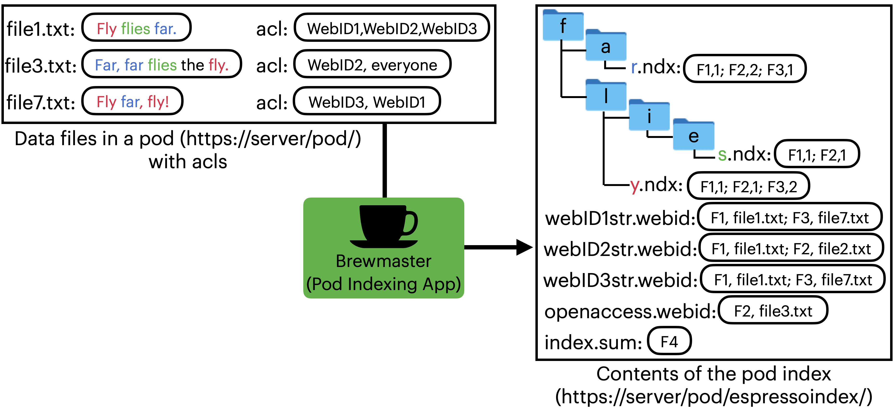

# Crawling
To create an index, first, one must collect all the documents that need to be represented. 
Normally, in the context of web search, it is done by web crawlers that collect information 
from different web pages. Since in ESPRESSO, we index each pod separately, 
all the files are in ‘one place’ already, and there is no need for a web crawler. 
Ideally, the pod owner would decide which files they want to be indexed and therefore searchable 
(adding the PodIndexer application’s WebID to the relevant acl’s). 
Then we can recursively crawl the contents starting with the top-level container --- the pod itself. 

Currently, to index the pod contents we log in to the pod. 

The script `PodIndexer.aclcrawlwebidnew` given the address of the container, 
address of the pod, and access to the pod, recursively crawls the given solid container 
and returns a list of tuples of the form `(filepath,text,webidlist)`. 

# Text Preparation 

In the current implementation, before we index a text, we convert it to lowercase, 
and remove English stop words, all digits, and punctuation. 

# Index Structure and Storage
For each keyword, e.g., *fly*, present in the indexed text files, the Pod Indexing App 
creates a corresponding file in the index at the address `https://server/pod/espressoindex/f/l/y.ndx`. 
This file contains the fileIDs of each file that contains the word *fly* along with the corresponding 
frequency of appearance of the keyword in the file. For each WebID that has read access to some of 
the indexed files e.g., *WebID1*, the Pod Indexing App puts in the index a `webID1str.webid` file 
that contains the fileIDs and the actual filenames (e.g. `file1.txt`) of the files accessible by 
that WebID. Here, `webID1str` is a string that uniquely corresponds to the *WebID1* and can be 
a valid filename. To capture files that are accessible to everyone Pod Indexing App creates 
the file `openaccess.webid` that contains fileIDs and filenames of those files. Last, it creates 
a file `index.sum` that is not typically used for the search operation but contains the information 
required for updating the pod index (e.g., the list of the fileIDs for the files that were deleted, 
the next available fileID, etc.).

The script `PodIndexer.aclindextupleswebidnewdirs` turns a list of tuples of the form 
`(filepath, text, webidlist)` into an index – an instance of the class `PodIndexer.LdpIndex` 
that stores the index as a dictionary with filenames as keys and the contents of the index 
files as values. 

The script `PodIndexer.uploadaclindexwithbar` – uploads an index to a given pod, given the index, 
address of the index folder in the pod, and access to the pod. 
