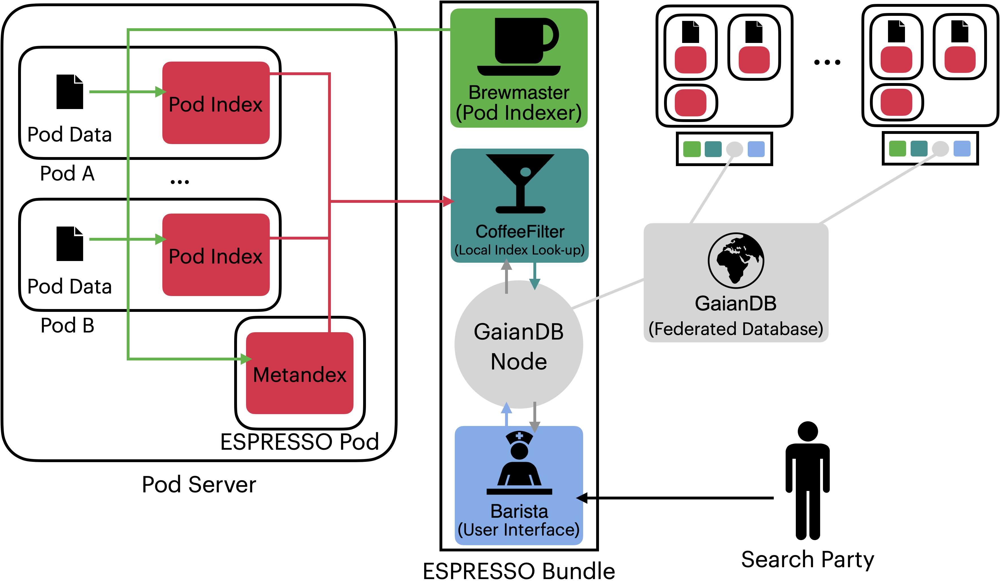

# ESPRESSO Search System

### Efficient Search over Personal Repositories - Secure and Sovereign!

The ESPRESSO project researches, develops and evaluates decentralised algorithms, meta-information data structures, and indexing techniques to enable large-scale data search across personal online datastores, taking into account varying access rights and caching requirements.

## Requirements

* [Node.js](https://nodejs.org/en/) _(16 or higher)_
* [Python](https://www.python.org/downloads/release/python-3110/)_(3.11 or higher)_
* [Ansible](https://docs.ansible.com/ansible/latest/installation_guide/intro_installation.html)

## Installation

## Quick start

## ESPRESSO System Architecture

## Limitations & Challenges Ahead
At this staage, ESPRESSO has the following limiations:

* It covers only keyword-based searches. Enabling structured queries is on the plan.
* To enable top-k search in ESPRESSO, decentralized ranking algorithms must be developed.

## Publications
* (1) [WISE 2023](https://doi.org/10.1007/978-981-99-7254-8_28)
    Mohamed Ragab, Yury Savateev, Reza Moosaei, Thanassis Tiropanis, Alexandra Poulovassilis, Adriane Chapman, and George Roussos. 2023. ESPRESSO: A Framework for&nbsp;Empowering Search on&nbsp;Decentralized Web. In Web Information Systems Engineering – WISE 2023: 24th International Conference, Melbourne, VIC, Australia, October 25–27, 2023, Proceedings. Springer-Verlag, Berlin, Heidelberg, 360–375.
* (2)[INWES 2021](https://eprints.soton.ac.uk/453937/1/inwes2021_tiropanis_et_al_submitted.pdf)
    Tiropanis, Thanassis, Poulovassilis, Alexandra, Chapman, Age and Roussos, George (2021) Search in a Redecentralised Web. In Computer Science Conference Proceedings: 12th International Conference on Internet Engineering &amp; Web Services (InWeS 2021).

## License
ESPRESSO is written and developed by the [ESPRESSO project](https://espressoproject.org/) 
This code is released under the [AGPL-3.0 license](https://github.com/espressogroup/ESPRESSO/blob/main/LICENSE)